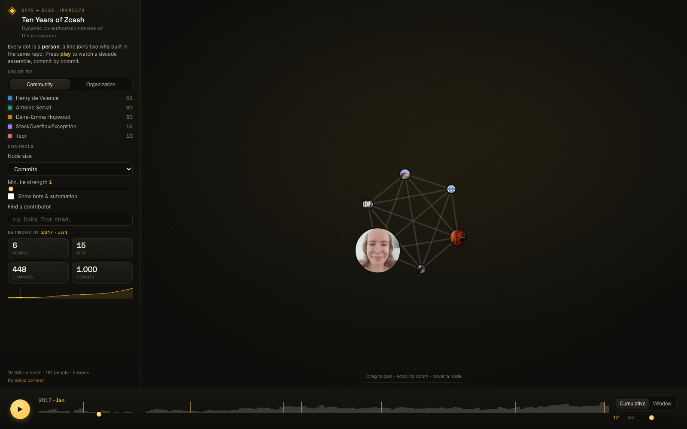
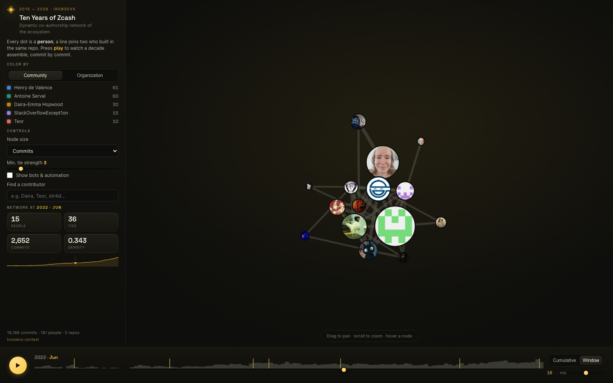
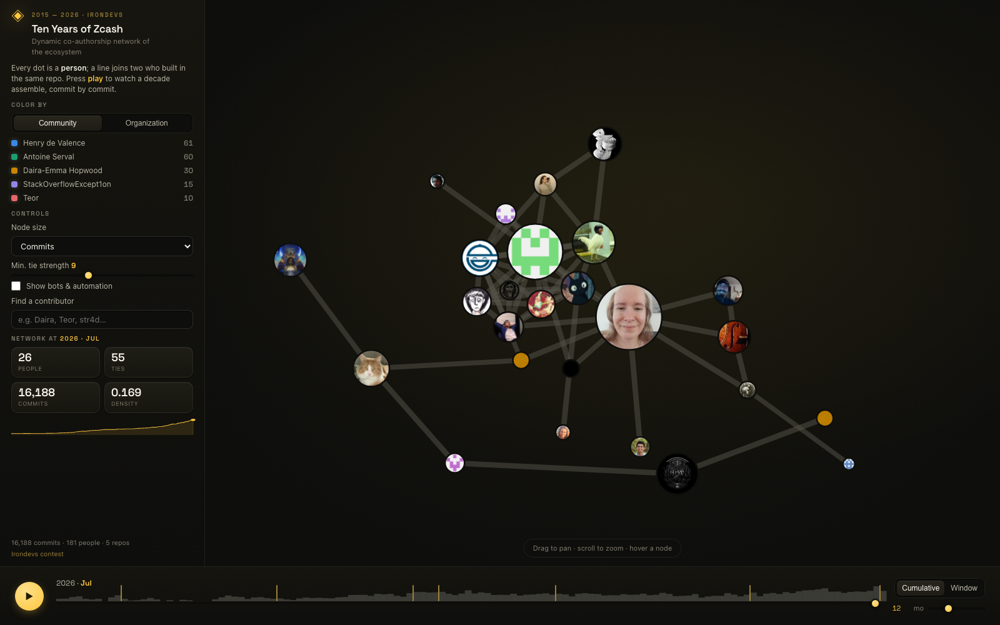
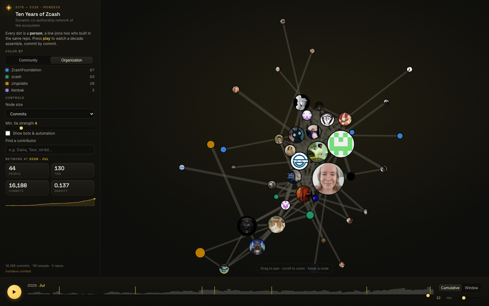

# Ten Years of Zcash — Dynamic Co-Authorship Network

> An animated, time-sliceable map of everyone who built Zcash, and who they built it with — a decade of commits assembled into a living network, in the browser.


Every dot is a **person**. Every line joins two people who committed inside the
same repository. Press **play** and a decade of collaboration assembles itself
month by month, from the six-person founding team in 2015 to the 180-strong
ecosystem that ships Ironwood.

This is the [Irondevs contest](https://github.com/jenkin/zcash-irondevs)
deliverable: the *dynamic co-authorship network* (the projection of the
bipartite author↔repository graph), with animated, interactive visualization.

---

## Quick start

Two ways to run it. Both mine the bare repositories in `data/` and produce
`web/graph.json`, which the browser front-end renders.

### With `uv` (recommended for review)

```bash
# from the contest repo root — clone the repositories once
./init.sh

# from this folder
uv sync
uv run ironwood                 # mine -> build -> web/graph.json
uv run python -m http.server 8080 --directory web
# open http://localhost:8080
```

Contributor avatars are committed under `web/avatars/`, so they show out of the
box. To refresh or extend them (needs the `gh` CLI authenticated), add
`--avatars`: `uv run ironwood --avatars` — it maps commit emails to GitHub users,
downloads any missing avatars locally, and caches the rest.

### With Docker

```bash
# mounts the repo-root data/ folder and serves on :8080
docker build -t zcash-irondevs .
docker run --rm -p 8080:8080 -v "$(pwd)/../../data:/data:ro" zcash-irondevs
# open http://localhost:8080
```

`uv run ironwood` finishes in **~6 s cold, ~1.5 s warm** on the five seed repos
(16,188 commits). Re-runs are incremental — unchanged repositories are served
from cache and only new commits are mined.

---

## What you can do with it

| | |
|---|---|
| ▶ **Play the decade** | watch the network grow commit-by-commit, 2015 → 2026 |
| 🕑 **Slice time** | scrub to any month; switch **Cumulative** ↔ **Window** for a sliding N-month view of *who was active together right now* |
| 👤 **See the people** | nodes show real **GitHub avatars** (fetched via `gh`, downloaded locally, ringed in their community color) |
| 🎨 **Recolor** | by detected **community** (Louvain) or by **organization** |
| 🔍 **Find anyone** | search a contributor, zoom to them, see their strongest ties |
| 🎚 **Declutter** | raise *minimum tie strength* to reveal only the tightest collaborations |
| 🏷 **Milestones** | Sprout, Sapling, Heartwood, Canopy, NU5, NU6, Ironwood marked on the timeline |
| 🤖 **Bots** | automation accounts (dependabot, mergify, …) are detected and off by default |

Any view is **deep-linkable** via query parameters, e.g.
`?color=org&w=8&mode=window&win=18&t=78`.

<table>
<tr>
<td><br/><em>2017 — the founding team</em></td>
<td><br/><em>NU5 era, sliding 18-month window</em></td>
</tr>
<tr>
<td><br/><em>Only the strongest co-authorships</em></td>
<td><br/><em>Colored by organization</em></td>
</tr>
</table>

---

## Contest requirements → where they live

| Required feature | How it's implemented |
|---|---|
| **Bipartite → author projection** | `pipeline/graph.py` — authors↔repos, projected to co-contribution edges; direct `Co-authored-by` trailers add weight |
| **Incremental updates** | `pipeline/mine.py` — per-repo cache keyed by `HEAD`; unchanged repos skipped, changed repos append only unseen commits |
| **Custom time slicing** | monthly-bucketed model; front-end **Cumulative** and sliding **Window** modes, any month |
| **Author deduplication** | `pipeline/identity.py` — union-find over name/email aliases, GitHub `noreply` normalization, bot tagging |
| **Web-based interactive viz** | `web/` — D3 force graph, animation, search, filters, tooltips (no build step, D3 vendored locally) |
| *Extra:* **multi-process** | `pipeline/mine.py` — one worker process per repository |
| *Extra:* **network metrics** | degree, betweenness, Louvain communities, plus a per-month density/size **timeline** |

---

## How the network is built

**Bipartite graph.** Each commit contributes its *authorship set* — the author
plus any `Co-authored-by` trailers — as edges to the repository it lands in.

**Projection.** Two contributors are linked when they have both committed to a
shared repository. An edge is *born* the month the later of the two first
touches that shared repo, and it gains weight every time they pick up another
shared repo. Committing the **same commit** (a `Co-authored-by` trailer) is a
far stronger signal than merely sharing a repo, so those ties add extra,
month-stamped weight. The result: `weight(edge) == Σ monthly increments`, so the
tie-strength filter is meaningful at every threshold and consistent through time.

**Deduplication.** Contributors commit under many identities. We union-find over
`(name, email)` pairs: merge on a shared normalized email, or a shared specific
name; collapse GitHub `noreply` addresses to their stable handle; tag — never
silently drop — automation accounts. On the seed data this collapses 246 raw
email identities into **181 real people**.

**Everything is monthly-bucketed**, so the front-end can show the cumulative
network up to month *T*, or a sliding window *[T−w, T]*, with no server round-trip.

---

## Architecture

```
pipeline/
  mine.py       PyDriller metadata mining · multiprocessing · incremental cache
  identity.py   author deduplication (union-find) + bot detection
  graph.py      bipartite projection, temporal weights, communities, metrics
  cli.py        mine -> build -> web/graph.json
web/
  index.html    layout
  app.js        D3 force graph, timeline, filters, search (no framework)
  style.css     dark, Zcash-gold theme
  lib/d3.v7.min.js
```

The pipeline emits a single `graph.json` (nodes, links, per-month series,
metrics timeline). The front-end is static — it reads that file and needs
nothing but a file server. D3 is vendored, so the whole thing runs **offline**.

**Design choices for review.** The recommended `networkx-temporal` / `pathpyG`
stack is powerful but heavy; the temporal layer here is a few dozen lines of
explicit, auditable Python over `networkx` + `python-louvain`, which keeps the
graph model easy to read and the whole dependency set small — deliberately, per
the contest's "no spaghetti, code I can review" note. Colors use a
CVD-validated categorical palette; the UI is theme-aware and accessible.

---

## Data

The five seed repositories in `repositories.dat`:

`ZcashFoundation/zebra` · `ZcashFoundation/frost` · `zcash/zips` ·
`zingolabs/zaino` · `Kenbak/cipherscan`

The pipeline discovers whatever bare repos exist under the data root, so it
scales unchanged to the judge's full local mirror.

## License

See [LICENSE.md](LICENSE.md) (MIT). D3.js is under the ISC license.
