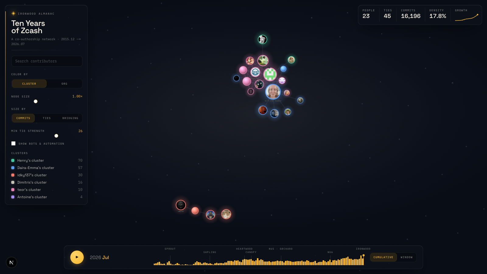
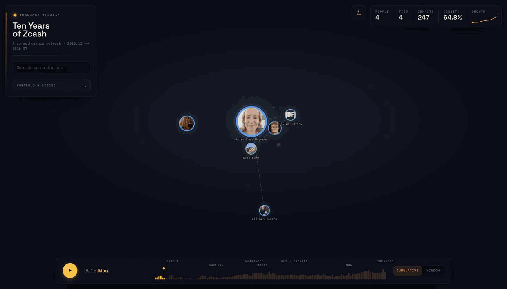

# Ten Years of Zcash — Dynamic Co-Authorship Network

> An animated, time-sliceable map of everyone who built Zcash and who they built it with — a decade of commits assembled into a living network, in the browser.



*The decade replaying — from the founding team to the Ironwood-era ecosystem:*



Every dot is a **person**. Every line joins two people who worked in the same
repository, weighted by how many months they were actually active there together.
On load the piece **plays the decade back** — from the founding handful in 2016 to
the ~190-strong ecosystem that ships Ironwood — narrated at each Zcash network
upgrade; then you can *explore*. Contributor nodes carry their real GitHub avatars,
ringed in their detected community color.

This is the [Irondevs contest](https://github.com/jenkin/zcash-irondevs)
deliverable: the *dynamic co-authorship network* (the projection of the bipartite
author↔repository graph), with animated, interactive visualization.

---

## Run it in 5 seconds (no build)

The visualization is **pre-built and committed** to `web-next/out/` — serve those
static files, no Node/npm/build required:

```bash
python3 -m http.server 8080 -d projects/Giri-Aayush/web-next/out
# open http://localhost:8080   (or: npx serve projects/Giri-Aayush/web-next/out)
```

## Regenerate against your archive

To render your own mirror instead of the committed seed data, run the Python
pipeline, then rebuild the static site:

```bash
./init.sh                                   # from the contest root — clone the repos
cd projects/Giri-Aayush
uv sync
uv run ironwood                             # mine → dedup → project → web-next/public/graph.json
cd web-next && npm ci && npm run build      # → out/
```

**Reviewing the code?** Everything worth reading is `pipeline/*.py` (≈140 lines
each) and `web-next/src/` (`lib/graph.ts`, `lib/store.ts`, `components/*`).
`web-next/out/` is only the compiled static output for zero-build running.

---

## The data on load

The committed seed archive is the five repos in `repositories.dat`
(`ZcashFoundation/zebra` · `frost`, `zcash/zips`, `zingolabs/zaino`,
`Kenbak/cipherscan`): **16,196 commits · 192 deduplicated contributors ·
Dec 2015 → Jul 2026**. The pipeline discovers whatever bare repos exist under the
data root, so it scales unchanged to the full CodeZ mirror.

## Built to survive the full archive

The judge runs this on 500+ repos / millions of commits. The pipeline is built for
that, not just the sample:

- **Fault-isolated mining** — a repo that fails mid-traversal (empty/unborn HEAD,
  corrupt ref, non-UTF-8 metadata) is skipped, never aborting the run
  (`mine.py`); author strings are unicode-sanitized so no single name can crash
  the cache write or the JSON export.
- **Bounded output** — the rendered network is capped to the top-N contributors
  by commits and the strongest ties (`--max-nodes`, internal `max_edges`), applied
  *before* projection, so `graph.json` and the browser stay fast no matter how
  dense the core is.
- **Validated at scale** — a synthetic 400k-commit / 2,500-contributor archive
  builds in ~25 s at ~0.5 GB RAM into a ~2.4 MB `graph.json`. (Cold mining of the
  real multi-GB archive is I/O-bound in PyDriller; the incremental `HEAD`-keyed
  cache makes every subsequent run near-instant.)

---

## What you can do

| | |
|---|---|
| ▶ **Watch the decade** | auto-plays 2015→2026 with a narrated caption at each upgrade; "skip → explore" any time |
| 🕑 **Slice time** | scrub to any month; **Cumulative** or a sliding **Window** of who was active together |
| 🎨 **Recolor** | by detected **community** (Louvain) or **organization** |
| 📐 **Size by** | commits, collaborators (degree), or **bridging** (betweenness) |
| 🎚 **Declutter** | raise *minimum tie strength* to isolate the tightest collaborations |
| 👤 **Find anyone** | search → the camera flies to them and lights up their ties |
| 🏷 **Read the hierarchy** | the top contributors are always labelled; the long tail sits as a muted "sea" |

## Contest requirements → where they live

| Required feature | Where |
|---|---|
| Bipartite → author projection | `pipeline/graph.py` |
| Incremental updates | `pipeline/mine.py` (per-repo `HEAD` cache) |
| Custom time slicing | `web-next/src/lib/graph.ts` + `Timeline.tsx` (cumulative / window) |
| Author deduplication | `pipeline/identity.py` (union-find; conservative name-merge) |
| Web interactive viz | `web-next/` |
| *Extra:* multiprocessing | `pipeline/mine.py` (one worker per repo) |
| *Extra:* network metrics | degree, betweenness, Louvain communities, per-month density timeline — surfaced via **Size by** + the stats bar |

## How a tie is measured

Two contributors are linked when they were active in the same repository. The
tie's weight is the number of **months they were both active there** (summed
across shared repos), plus any `Co-authored-by` commits — so long-running
collaborators clearly outweigh one-off overlaps, and `weight == Σ monthly
increments` holds so the strength filter stays consistent through time. Identities
are union-found over `(name, email)`, merging on shared email or a full "First
Last" name (never a bare common first name), so the graph reflects people.

## Notes

- Front-end: Next.js + Tailwind + D3 + Framer Motion, **static-exported** (no
  server). Network math uses `networkx` + `python-louvain` with an explicit,
  reviewable temporal layer rather than `networkx-temporal`/`pathpyG`, to keep the
  dependency surface small and the model easy to audit.
- Design language crafted in Claude Design; implementation is original.

## License

See [LICENSE.md](LICENSE.md) (MIT). D3.js is under the ISC license.
