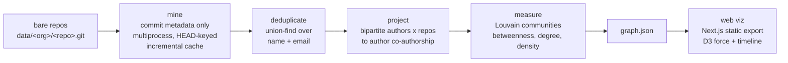

# Ten Years of Zcash, a Dynamic Co-Authorship Network

> An animated, time-sliceable map of everyone who built Zcash and who they built it with. A decade of commits, assembled into a living network, in the browser.

**Live demo: [ten-years-of-zcash.netlify.app](https://ten-years-of-zcash.netlify.app)** (the committed seed data, no install needed)


*The decade replaying, from the founding team to the Ironwood-era ecosystem:*


Every dot is a **person**. Every line joins two people who worked in the same
repository, weighted by how many months they were actually active there
together. On load, the piece **plays the decade back**, from the founding
handful in 2016 to the roughly 190-strong ecosystem that ships Ironwood,
narrated at each Zcash network upgrade. Then you explore. Contributor nodes
carry their real GitHub avatars, ringed in their detected community color.

This is the [Irondevs contest](https://github.com/jenkin/zcash-irondevs)
deliverable: the *dynamic co-authorship network* (the projection of the
bipartite author-repository graph), with an animated, interactive
visualization.

---

## See it now

The committed seed data is deployed at
**[ten-years-of-zcash.netlify.app](https://ten-years-of-zcash.netlify.app)**,
no install needed. Only source is committed here (no build artifacts), so
running locally is one Docker command:

```bash
cd projects/Giri-Aayush
docker build -t ten-years-of-zcash .
docker run --rm -p 3000:3000 ten-years-of-zcash
# open http://localhost:3000
```

Or without Docker:

```bash
cd projects/Giri-Aayush/web-next
npm ci && npm run build
npx serve out            # or: python3 -m http.server 8080 -d out
```

## Regenerate against your archive

To render your own mirror instead of the committed seed data, run the Python
pipeline, then rebuild the static site:

```bash
./init.sh                                   # from the contest root, clone the repos
cd projects/Giri-Aayush
uv sync                                     # installs pydriller, networkx, python-louvain, pillow
uv run ironwood                             # mine -> dedup -> project -> web-next/public/graph.json
cd web-next && npm ci && npm run build      # -> out/
```

`uv run ironwood --help` lists every flag (`--data`, `--workers`,
`--no-incremental`, `--avatars`, `--max-nodes`). The pipeline autodetects the
contest `data/` folder and discovers whatever bare repos live under it, so it
scales unchanged from the five-repo sample to the full CodeZ mirror.

**Reviewing the code?** Everything worth reading is `pipeline/*.py` (about 140
lines each) and `web-next/src/` (`lib/graph.ts`, `lib/store.ts`,
`components/*`). Only source is committed; the static site is reproduced by
`npm ci && npm run build`.

---

## How it works



Mining reads **commit metadata only** (author, committer, co-authors, date),
never diffs or file contents, so it is fast and safe to run against a mirror of
someone else's bare repositories. Each stage is a small, single-purpose module
you can read top to bottom.

### How a tie is measured

Two contributors are linked when they were active in the same repository. The
tie's weight is the number of **months they were both active there** (summed
across shared repos), plus any `Co-authored-by` commits. Long-running
collaborators clearly outweigh one-off overlaps, and the invariant
`weight == sum of monthly increments` holds, so the strength filter stays
consistent as you scrub through time.

### How identities are merged

A single human commits under many identities (work email, personal email, the
GitHub `noreply` address, spelling variants of a name, machine accounts). We
union-find over every observed `(name, email)` pair, merging on a shared
normalized email or a full "First Last" name (never a bare common first name),
and normalize GitHub `noreply` addresses to their stable id. Bot and automation
identities are detected and tagged rather than dropped, so you can filter them
without losing the data.

---

## What you can do

| | |
|---|---|
| **Watch the decade** | auto-plays 2015 to 2026 with a narrated caption at each upgrade; skip to explore any time |
| **Slice time** | scrub to any month; **Cumulative**, or a sliding **Window** of who was active together |
| **Recolor** | by detected **community** (Louvain) or **organization** |
| **Size by** | commits, collaborators (degree), or **bridging** (betweenness) |
| **Declutter** | raise the *minimum tie strength* to isolate the tightest collaborations |
| **Find anyone** | search, and the camera flies to them and lights up their ties |
| **Open a profile** | click a node for a card with their repos, closest collaborators, and stats |
| **Light or dark** | a control-room dark theme and a clean daylight theme, remembered per browser |

The interface rests quiet by default (masthead, search, timeline), with the
full control set one click away, so the network itself stays the subject.

---

## Built to survive the full archive

The judge runs this on 500+ repos and millions of commits. The pipeline is
built for that, not just the sample:

- **Fault-isolated mining.** A repo that fails mid-traversal (empty or unborn
  `HEAD`, corrupt ref, non-UTF-8 metadata) is skipped, never aborting the run.
  Author strings are unicode-sanitized so no single name can crash the cache
  write or the JSON export.
- **Incremental by `HEAD`.** Each repo's commits are cached and keyed to its
  `HEAD`. Unchanged repos are skipped entirely; changed repos append only the
  new commits. The first run mines cold; every run after is near-instant.
- **Bounded output.** The rendered network is capped to the top contributors by
  commits and the strongest ties (`--max-nodes`, internal edge cap), applied
  *before* projection, so `graph.json` and the browser stay fast no matter how
  dense the core is. Pass `--max-nodes 0` to render everyone; the metadata
  always reports the true total alongside what is shown.
- **Verified on real bare repos.** Mining, dedup, projection, metrics, and the
  incremental cache were each exercised end to end against a `--bare` clone in
  the exact `data/<org>/<repo>.git` layout the judge uses.

---

## Contest requirements, and where they live

| Required feature | Where |
|---|---|
| Bipartite to author projection | `pipeline/graph.py` |
| Incremental updates | `pipeline/mine.py` (per-repo `HEAD` cache) |
| Custom time slicing | `web-next/src/lib/graph.ts` + `Timeline.tsx` (cumulative / window) |
| Author deduplication | `pipeline/identity.py` (union-find, conservative name merge) |
| Web interactive viz | `web-next/` |
| *Extra:* multiprocessing | `pipeline/mine.py` (one worker per repo) |
| *Extra:* network metrics | degree, betweenness, Louvain communities, per-month density, surfaced via **Size by** and the stats bar |

## The data on load

The committed seed archive is the five repos in `repositories.dat`
(`ZcashFoundation/zebra`, `ZcashFoundation/frost`, `zcash/zips`,
`zingolabs/zaino`, `Kenbak/cipherscan`): **16,196 commits, 192 deduplicated
contributors, Dec 2015 to Jul 2026.**

## Notes on the build

- **Front end:** Next.js + Tailwind + D3 + Framer Motion, **static-exported**
  (no server). The network math uses `networkx` + `python-louvain` with an
  explicit, reviewable temporal layer rather than `networkx-temporal` or
  `pathpyG`, to keep the dependency surface small and the model easy to audit.
- **Avatars:** resolved from the GitHub commits API, downloaded locally, and
  committed so the site is offline-safe. GitHub's default identicons are
  detected and skipped so those nodes render as clean community-colored spheres
  instead of placeholder blocks; real photos and logos are kept.
- **Design language** crafted with Claude Design; the implementation is
  original.

## License

See [LICENSE.md](LICENSE.md) (MIT). D3.js is under the ISC license.
